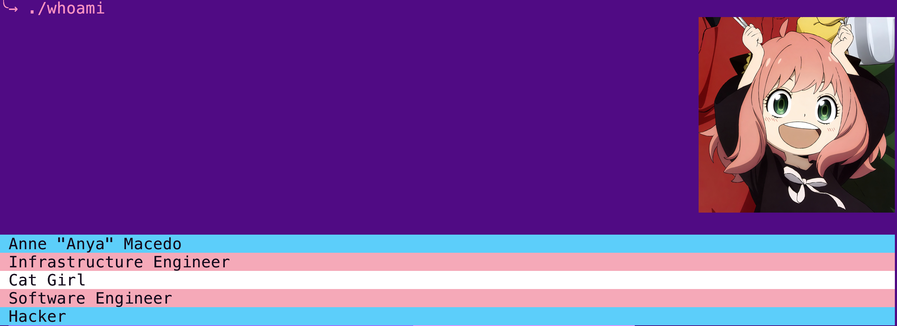

# retpolanne - Anne Isabelle "Anya" Macedo 🐱🏳️‍⚧️
## Your friendly programmer catgirl 

Pronouns she/her

Hello, I'm Anne. You can call me Annie or Anya as well :)

I'm a software engineer, infrastructure engineer and hacker.

I'm currently working on writing Kernel patches, automating my environment with Ansible and Terraform and making dev environments with Nix. I'm currently learning embedded Linux development. 

I love to learn about low level software development, hacking techniques and microarchitectures. 

Fun fact: my username comes from Retpoline, a mitigation for the branch target injection attack that was discovered on the Meltdown/Spectre vulnerabilities. 

Reach me at retpolanne@posteo.net.

## Open Source Brag Document

### Merged patches 

- kernel perf-tools [perf lock contention: Trim backtrace by skipping traceiter functions](https://git.kernel.org/pub/scm/linux/kernel/git/perf/perf-tools.git/commit/?id=2a5049b75d22c971e73501784f10548c1d69c407&h=perf-tools)
- pypa/pip [Fix is_url from splitting the scheme incorrectly when using PEP 440's direct references #6203](https://github.com/pypa/pip/pull/6203)
- kubernetes/ingress-gce [Added NoSchedule effect to GetNodeConditionPredicate #792](https://github.com/kubernetes/ingress-gce/pull/792)
- kubernetes/kubernetes [Moving e2e boilerplate to separate functions #79909](https://github.com/kubernetes/kubernetes/pull/79909)
- ansible-community/molecule [Adds vpc_id to ec2_group, from subnet facts, and allows to specify SG ip cidr #2405](https://github.com/ansible-community/molecule/pull/2405)
- ansible-community/molecule [Added instance_profile_name to ec2 driver #2370](https://github.com/ansible-community/molecule/pull/2370)
- linux-sunxi/meta-sunxi [add u-boot ethernet support to orange pi one plus (h6) #389](https://github.com/linux-sunxi/meta-sunxi/pull/389)

### Patches awaiting approval/merge

- flashrom [flashchips: Add support for PUYA P25Q40H](https://review.coreboot.org/c/flashrom/+/76251)
- u-boot [[PATCH] sunxi: H6: Enable Ethernet on Orange Pi One Plus](https://lore.kernel.org/u-boot/20230711003957.658805-2-retpolanne@posteo.net/T/#u)

### Rejected patches 

- linux kernel [[PATCH] libbpf: add validation to BTF's variable type ID](https://lore.kernel.org/bpf/20220929160558.5034-1-annemacedo@linux.microsoft.com/)
- linux kernel [[PATCH] usb: host: xhci: parameterize Renesas delay/retry](https://lore.kernel.org/lkml/2023061951-taekwondo-unsoiled-faf2@gregkh/T/)
- linux kernel [[PATCH] usb: host: xhci: remove renesas rom wiping](https://lore.kernel.org/lkml/20230626204910.728-3-retpolanne@posteo.net/T/)
- linux kernel [[PATCH] arm64: dts: allwinner: Orange Pi One Plus PHY support](https://lore.kernel.org/lkml/1962081.yKVeVyVuyW@jernej-laptop/T/#m96d2637c291110d748f5bc6df23abd311e5eb6f6)
